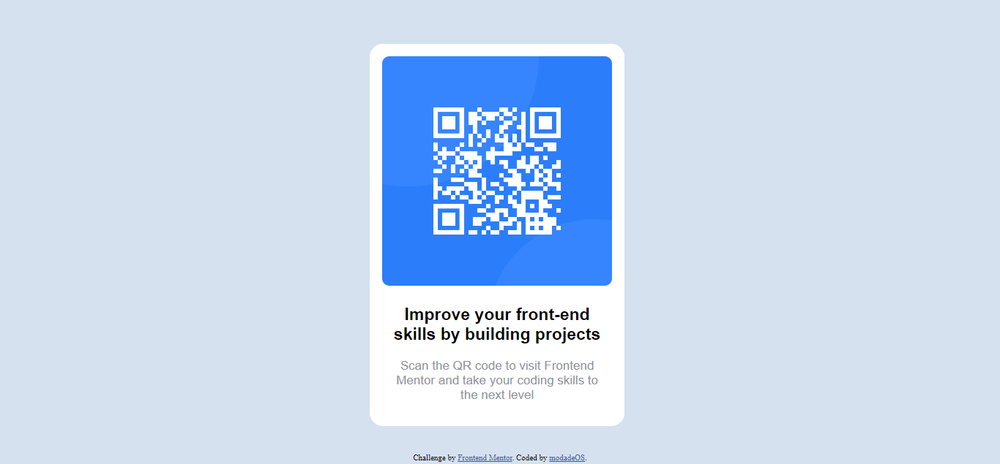
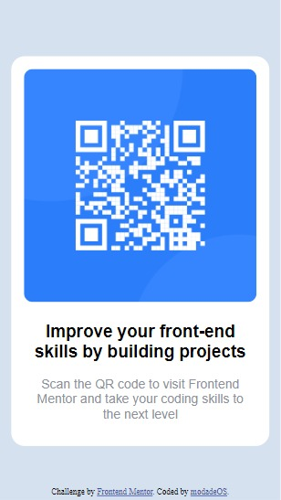

# Frontend Mentor - QR code component solution

This is a solution to the [QR code component challenge on Frontend Mentor](https://www.frontendmentor.io/challenges/qr-code-component-iux_sIO_H). Frontend Mentor challenges help you improve your coding skills by building realistic projects. 

## Table of contents

- [Overview](#overview)
  - [Screenshot](#screenshot)
  - [Links](#links)
- [My process](#my-process)
  - [Built with](#built-with)
  - [What I learned](#what-i-learned)
  - [Continued development](#continued-development)
  - [Useful resources](#useful-resources)
- [Author](#author)

**Note: Delete this note and update the table of contents based on what sections you keep.**

## Overview
This solution focuses on the use of Flexbox for the development of this QR code component design, a lot of margin padding and position was also used to achieve the right width and balance in the design.

### Screenshot

## My process
I started by applying div containers to my HTML, because i already had it in mind to use Flexbox to design this Qr-code-compenet, after that i began to style my work, it wasn't simple but wasn't difficult has i had in mind what i wanted as i designed.
created my flex container using css, and the majority of the warok was left to margin, padding and positioning.

### Built with
- Semantic HTML5 markup
- CSS custom properties
- Flexbox
- Mobile-first workflow
- Media Queries

### What I learned
Use this section to recap over some of your major learnings while working through this project. Writing these out and providing code samples of areas you want to highlight is a great way to reinforce your own knowledge.

Started this design having made up my mind to use flexbox, decided to use Flexbox: 1. For fluidity. 2. for Mobile-first workflow. 
- This is the first project i have ever used Media Queries for, this build has helped me kickstart my learning of Media Queries.

### Continued development
Use this section to outline areas that you want to continue focusing on in future projects. These could be concepts you're still not completely comfortable with or techniques you found useful that you want to refine and perfect.

- During the building of this design i realized that i suck at Responsive Web Design (RWD) as i tried to make this design fit various sizes and i couldn't even though i started the build with mobile first.
- I also realized that i need to practice more with CSS and learn a CSS     Framework ASAP. And also master the use of basic concepts and when or not to use them, eg. Margin, Padding, Position.
- Overall i feel more practice of CSS will make me more fluent in designing
- I plan to also build more designs in hopes of improving my skills with Frontend Mentor challenges. 

### Useful resources
- [Example resource 1](https://www.w3schools.com) - This helped me for XYZ reason. I really liked this pattern and will use it going forward.

## Author
- Frontend Mentor - [@modade97](https://www.frontendmentor.io/profile/modade97)
- Twitter - [@modadegospel](https://www.twitter.com/modadegospel)

