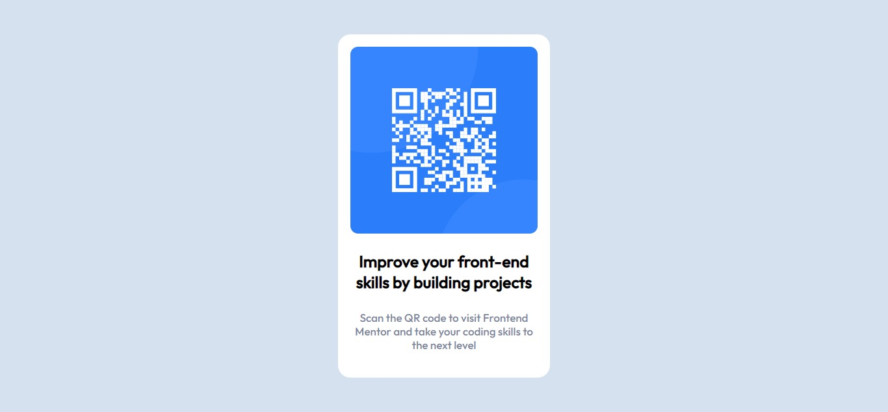

# Frontend Mentor - QR code component solution

This is a solution to the [QR code component challenge on Frontend Mentor](https://www.frontendmentor.io/challenges/qr-code-component-iux_sIO_H). Frontend Mentor challenges help you improve your coding skills by building realistic projects. 

## Table of contents

- [Overview](#overview)
  - [Screenshot](#screenshot)
  - [Links](#links)
- [My process](#my-process)
  - [Built with](#built-with)
  - [What I learned](#what-i-learned)
  - [Continued development](#continued-development)
  - [Useful resources](#useful-resources)
- [Author](#author)

**Note: Delete this note and update the table of contents based on what sections you keep.**

## Overview
This solution focuses on the use of Flexbox for the development of this QR code component design, a lot of margin padding and position was also used to achieve the right width and balance in the design.

### Screenshot

.jpg)

## My process
- Started by applying the proper HTML semantics then some div containers to make the design as easy as it can be, Flexbox was used to achieve the 375px mobile Responsive. After some advice from the first submition I switched px units to em units, and changed relatively a lot of things to make this better

### Built with
- Semantic HTML5 markup
- CSS custom properties
- Flexbox

### What I learned
Started this design having made up my mind to use flexbox, decided to use Flexbox: 1. For fluidity. 2. for Mobile-first workflow. 
- However after the first submition and the advices and suggestions that came along i realised that i could've done it in a better way and that media queries were not necessary for this project and fluidity could be achieved through the use of flexbox alone.

### Continued development
- During the buidling of this proect i realised that i should focus on learning how to properly center a div.
- I plan to also build more designs in hopes of improving my skills with Frontend Mentor challenges. 

### Useful resources
- [Resource 1](https://www.w3schools.com) - This site helped in general as i could always go back to it if i need aything.
- [Resource 2](https://moderncss.dev/resource-the-complete-guide-to-centering-in-css/) - This site helped in understanding how to properly center any element in CSS.

## Author
- Frontend Mentor - [@modade97](https://www.frontendmentor.io/profile/modade97)
- Twitter - [@modadegospel](https://www.twitter.com/modadegospel)

## Acknowledgement
i want to thank these Frontend Mentor users: https://www.frontendmentor.io/profile/@MelvinAguila | https://www.frontendmentor.io/profile/@vanzasetia | https://www.frontendmentor.io/profile/correlucas | for their help, after the first submition they gave valuable advice that helped in recreating this build to what it is now (BETTER).

